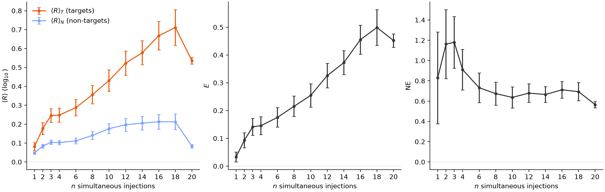

# Does DiffusionGemma have latent reasoning?

## TL;DR:

Google DeepMind's recent model DiffusionGemma (DG) works differently from regular language models, including by passing distribution vectors in addition to tokens between generation steps. A priori, this allows it to pass vector-valued information that is illegible to monitors, sometimes called "latent reasoning". A recent paper found that DG nevertheless maintains high monitorability, but at the same time found that ablating the passed distribution degrades performance.
Here, we show that this performance degradation is largely a sampler artifact, supporting the case for high monitorability. Nevertheless, we find some rare cases where the distribution vector is load-bearing computationally, however in a way that is easily interpretable.
Overall, this underlines the paper's conclusion that DiffusionGemma remains highly monitorable, while nevertheless showing that there are cases where models can learn to use vector-valued information.

## Introduction

DiffusionGemma is a text-generation model, based on the Gemma architecture. In short, generation looks like the following. Let $p$ be the prompt, and let $x_0\in\mathcal{V}^{C}$ be the noise-initialised token canvas comprising $C$ positions. The self-conditioning state $\mathbf{S}_0\in\mathbb{R}^{C\times |\mathcal{V}|}$ is initialised uninformatively — there is no model output to feed back at the first step. Let $f$ denote a single forward pass through the transformer stack, which is a finetune of Gemma. Roughly, the final output $x_T$ then is obtained via

$$
\begin{aligned}
&\textbf{for } t = 0, \dots, T-1: \\[2pt]
&\qquad \mathbf{S}_{t+1} = f(p,\, x_t;\, \mathbf{S}_t) \\[2pt]
&\qquad x_{t+1} = \mathrm{sample}(\mathbf{S}_{t+1})
\end{aligned}
$$

where $T$ is the number of diffusion steps. Importantly, $x_t$ attends bidirectionally to itself, and causally to $p$. $\mathbf{S}_t[x_t]$ also functions as a confidence score for any token $x_t$: unless a confidence threshold is passed, $x_t$ gets replaced with a random token at every step $t$, facilitating exploration and correction. Two consequences matter for this post: at such open positions the canvas carries no information from one step to the next — $\mathbf{S}_t$ is the only memory the model has there — and the pace of commitment is set by this confidence gate, so anything that artificially sharpens $\mathbf{S}_t$ (such as truncating it to its top-k entries) makes the gate commit more positions, earlier.

For a visual and more detailed introduction to DiffusionGemma, see [this post](https://newsletter.maartengrootendorst.com/p/a-visual-guide-to-diffusiongemma).

Thus, generation in DiffusionGemma differs in the following ways:

1. Generation happens as reverse diffusion, not as token-by-token autoregression. This is reminiscent of a looped transformer.
2. Attention is bidirectional.
3. Between every diffusion step, not only the current text output is sampled, but the output distributions $\mathbf{S}_t$ across all positions are also passed to the next diffusion step $t+1$.

The last point is especially interesting, since it passes the vector-valued object between diffusion steps, in addition to the tokens $x_t$ lacking the $|\mathcal{V}|$ axis. A priori, this allows the model to transport drastically more information between diffusion steps in an illegible way, hindering monitorability.

## Performance degradation from top-k truncation largely is a sampler artifact

Despite this a-priori risk, [Engels et al.](https://arxiv.org/abs/2606.20560) found that DiffusionGemma scores similar monitorability to Gemma. [maybe give more deets] However, when truncating $\mathbf{S}_t$ to just its top-k entries, performance of DG significantly dropped. This was in conflict with their other results suggesting high monitorability, since somehow the information in $\mathbf{S}_t$ seemed to have been essential to DiffusionGemma.

When replicating their experiments, we observed that the model will often fall into a "degenerate loop", outputting the same token over and over, never reaching the final answer.

We found that adopting a gentler sampler largely prevents this failure mode, suggesting that in fact the distribution is not essential to solve these problems. However, this does not rule out that there is a functional necessity in other tasks that the paper had not investigated.

*A gentler sampler prevents the degenerate loop that caused performance degradation on top-k truncating the distributional state $\mathbf{S}_t$ observed in [Engels et al.](https://arxiv.org/abs/2606.20560)*.

## A case study for using the distribution computationally: letter arithmetic

We next investigated whether there may still be some other tasks where $\mathbf{S}_t$ in fact is essential. Note that in principle, there is no need for the model to use $\mathbf{S}_t$ whatsoever to satisfy its training objective (indeed, most of the phenomena in [Engels et al.](https://arxiv.org/abs/2606.20560) are explained by bidirectional attention+looping). However, it may facilitate trainability and exploration.

We therefore looked for tasks where the model plausibly would hold several "hypotheses" in superposition. Note that "superposition" in a simple form is already present in the pretraining data ("Today the weather is _", with "rainy" and "sunny" both plausible), so that we were especially interested in cases where this may have been induced by the model's generalization. [+compuaiton]

We prompt DG with tasks of the form *"Pick any uppercase letter between A and W, write it, then write the letter three positions later in the alphabet, also in uppercase, separated by a comma."* DG answers these correctly on its own (e.g. "Letters: G, J"). We then capture a rollout mid-denoising, add probability mass $\varepsilon$ on a *different* source letter $x$ at the operand position — keeping it strictly sub-leading, so the committed canvas never changes — and re-run exactly one denoising step on paired re-noised canvases. We read out the response at the answer position, $R_c(x') = \log_{10}\big(\bar P^{\mathrm{pert}}_c(x') / \bar P^{\mathrm{base}}_c(x')\big)$, where $\bar P$ averages over the paired draws.

*Injected mass lands on the diagonal: perturbing source letter $x$ raises its image $x+k$ one step later ($k\in\{3,5,7,11\}$, rows aligned by $-k$; left: argmax, right: mean response $R_c$). The offset follows the prompt, not the state. G column = committed operand (excluded); H/R rows are decode artifacts.*

Here is a single intervention in full:

*One intervention: injecting $\varepsilon=0.45$ on 'H' (the leader 'G' keeps rank 1, the canvas never changes) swings the answer slot from 'J' (0.996→0.05) to 'K'='H'+3 (0.0002→0.91) one step later — the answer tracks the belief at the operand slot, not the committed text.*

### Parallelism

[stub:] Does the interface serialize, or can it push many hypotheses through at once? We inject $n$ source letters simultaneously (each at flat $\varepsilon_0$, all sub-leading) and read all $n$ computed images. We track the target and non-target responses $\langle R_c\rangle_{T_c}$ and $\langle R_c\rangle_{N_c}$, the effect $E_c = \langle R_c\rangle_{T_c} - \langle R_c\rangle_{N_c}$, and the mass-normalized effect $\mathrm{NE}_c = E_c/(n\,\varepsilon_0)$.

*Letters (case-flip), mean ± 95% CI over 736 cells, $\varepsilon_0=0.04$. The effect $E_c$ grows with $n$ while the per-mass efficiency $\mathrm{NE}_c$ stays flat ≈0.6–0.7 out to $n=20$ — hypothesis count is not the bottleneck (numbers: same plateau ≈0.5). The mixed reference includes a case-band component; the band-free edge (≈0.2–0.4) is equally flat.*

## Appendix

How much of the standard AR interpretability toolkit survives the transfer to DG? Everything below is measured on the SAE-Probes real-text concept datasets (plus RepE tasks for steering and the J-Lens paper sets); DG additionally has two *modes* over one weight stack — causal reading and bidirectional denoising.

### A1: Representation similarity (cosine & CKA)

*Left: matched cosine; right: linear CKA (per layer, 3,584 texts). Mid-stack alignment is high across models and degrades from the deep global-attention layers on; the causal↔denoising mode switch — same weights — costs as much as the model gap (mean CKA 0.51 vs 0.81), and the gaps compound.*

### A2: Probe retention

*Top: mean held-out AUC (56 concepts, source-CV layer) — cross-model reading costs ~0.03 in both directions. Bottom: a held-out pair read by the same gemma-trained probe on both models' activations.*

### A3: Steering retention

*Top: blind-pair judge accuracy (judge must identify +steer vs −steer), 11 RepE tasks — every cell steers (0.70–0.85); denoising-mode directions are the weakest sources. Bottom: ±steer pair for the happiness direction (gemma-4 → DG); judge digest in italics.*

### A4: J-Lens retention

*Top: mean GT-appearance score $A=1-e^{-n}$ ($n$ = matching top-20 lens tokens; 551 items) — fitted Jacobian lenses transfer across the AR/diffusion boundary (gemma→DG retention ≈0.76). Bottom: a transfer hit and a miss.*
