# Does DiffusionGemma have latent reasoning?

## TL;DR

Google DeepMind's recent model DiffusionGemma (DG) works differently from regular language models, including by passing distribution vectors in addition to tokens between generation steps. A priori, this allows it to pass information that is illegible to monitors, sometimes called "latent reasoning". A recent paper found that DG nevertheless maintains high monitorability, but at the same time found that ablating the passed distribution degrades performance.
Here, we show that this performance degradation is largely a sampler artifact, supporting the case for high monitorability. Nevertheless, we find some rare cases where the distribution vector is load-bearing computationally, however in a way that is easily interpretable.
Overall, this supports the paper's conclusion that DiffusionGemma remains highly monitorable, while nevertheless showing that there are cases where models can learn to use vector-valued information.

Github: ...

## Introduction

DiffusionGemma is a text-generation model, based on the Gemma architecture. In short, generation looks like the following. Let $p$ be the prompt, and let $X^0\in\mathcal{V}^{C}$ be the noise-initialized token canvas comprising $C$ positions. Let $f$ denote a single forward pass through the transformer stack (a finetune of Gemma). Roughly, the final output $X^T$ then is obtained via

$$
\begin{aligned}
&\textbf{for } t = 0, \dots, T-1: \\[2pt]
&\qquad \mathbf{S}^{t+1} = f(p,\, X^t;\, \mathbf{S}^t) \\[2pt]
&\qquad X^{t+1} = \mathrm{sample}(\mathbf{S}^{t+1})
\end{aligned}
$$

where $T$ is the number of diffusion steps. Here, $(\mathbf{s}^t_i)_{i=1..C} = \mathbf{S}^t \in \mathbb{R}^{C\times|\mathcal{V}|}$ represents the distribution passed between diffusion steps. Importantly, $X^t$ attends bidirectionally to itself, and to $p$. $\mathbf{s}^t[x^t]$ also functions as a confidence score for any token $x^t$: unless a confidence threshold is passed, $x^t$ gets replaced with a random token at every step $t$, facilitating exploration and correction. This threshold is an _entropy bound_ on $\mathbf{s}^t_i$: positions are accepted in order of increasing entropy until the budget is spent, and every remaining position is renoised uniformly at random. The proposal tokens themselves are sampled from $\mathbf{s}^t$ at a temperature that anneals over the run. Together with the total number of diffusion steps $T$, which caps how many refinement passes the canvas receives, these are the sampler settings we adjust below.

For a visual and more detailed introduction to DiffusionGemma, see [this post](https://newsletter.maartengrootendorst.com/p/a-visual-guide-to-diffusiongemma).

Thus, generation in DiffusionGemma mainly differs in the following ways:

1. Generation happens as reverse diffusion, not as token-by-token autoregression. This is reminiscent of a looped transformer ([Giannou et al., 2023](https://arxiv.org/abs/2301.13196)).
2. Attention is bidirectional.
3. Between every diffusion step, not only the current text output is sampled, but the output distributions $\mathbf{S}^t$ across all positions are also passed to the next diffusion step $t+1$.

The last point is especially interesting, since it passes the vector $\mathbf{s}^t$ between diffusion steps, in addition to the token canvas $X^t$ lacking the $|\mathcal{V}|$ axis. A priori, this allows the model to transport drastically more information between diffusion steps in an illegible way, hindering monitorability.

## Performance degradation from top-k truncation largely is a sampler artifact

Investigating this risk, [Engels et al.](https://arxiv.org/abs/2606.20560) found that DiffusionGemma scores similar monitorability to Gemma [maybe give more details on what they found]. However, when truncating $\mathbf{s}^t$ to just its top-k entries, performance significantly dropped. Thus somehow the information in $\mathbf{s}^t$ seemed to have been essential, conflicting the results of high monitorability.

However, when replicating their experiments, we observed that the model will often fall into a "degenerate loop", outputting the same token over and over, never reaching the final answer. We found that adopting a gentler sampler largely prevents this failure mode, suggesting that in fact the distribution is not essential to solve these problems. Still, this does not rule out that there is a functional necessity in other tasks that the paper had not investigated.

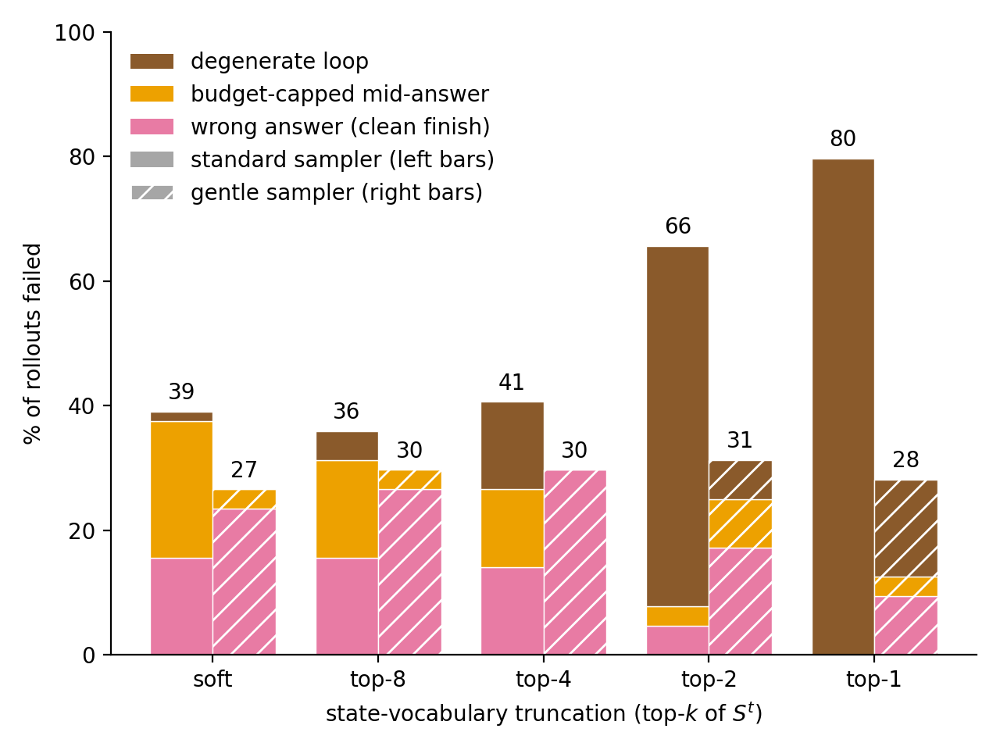

_**A gentler sampler prevents the degenerate loop that caused performance degradation on top-k truncating the distributional state $\mathbf{s}^t$ observed in [Engels et al.](https://arxiv.org/abs/2606.20560).** Specifically, we use more diffusion steps, a wider temperature range, and a lower entropy bound._

## A case study for using the distribution computationally: letter arithmetic

We next investigated whether there may still be some other tasks where $\mathbf{S}^t$ in fact is essential. Note that in principle, there is no need for the model to use $\mathbf{S}^t$ whatsoever to satisfy its training objective (indeed, most of the phenomena in [Engels et al.](https://arxiv.org/abs/2606.20560) are explained by bidirectional attention+looping). However, it may facilitate trainability and exploration.

We therefore looked for tasks where the model plausibly would hold several "hypotheses" in superposition. Note that superposition in a simple form is already present in the pretraining data (`Tomorrow the weather will be _`, with `rainy` and `sunny` both plausible), so that we were especially interested in cases where this 1) has instead been induced by the model's generalization, 2) involves nontrivial computation (the latter is important, since some superposition may be explained by "interpolating" the training distribution).

We therefore looked for a task that requires DG to make an unspecified choice, and to do a computation on that choice. Specifically, we consider _letter arithmetic_:

```Pick any uppercase letter``` (the operand $x$) ```between A and W, write it, then write the letter``` (the target $x'$) ```3 ```(the increment $k$)``` positions later in the alphabet.```

DG answers these correctly, consistently choosing its own _natural_ operand $x^{t}_{\mathrm{nat}}$ and target $x^{\prime\,t+1}_{\mathrm{nat}}$  (e.g. ```Letters: G, J```). To intervene on this computation, we capture the canvas at some intermediate denoising step $t$, add probability mass $\epsilon$ on a *different* operand letter $x\neq x_{\mathrm{nat}}$ at the operand position. Importantly, we choose the injection such that $\mathbf{s}^t[x]+\epsilon$ is still not the top logit. This is important, because we would like to measure what DG does to states that are not the most probable ones.

Then, we measure the response to that perturbation $\mathbf{R}[x^{\prime\,t+1}\vert\mathrm{pert}(x^t)] = \log_{10}\big(\bar{\mathbf{s}}_{\mathrm{pert}}^{t+1}[x^{\prime\,t+1}]\, / \,\bar{\mathbf{s}}_{\mathrm{base}}^{t+1}[x^{\prime\,t+1}]\big)$, where $\bar{ \mathbf{s}}$ indicates an average over seeds.

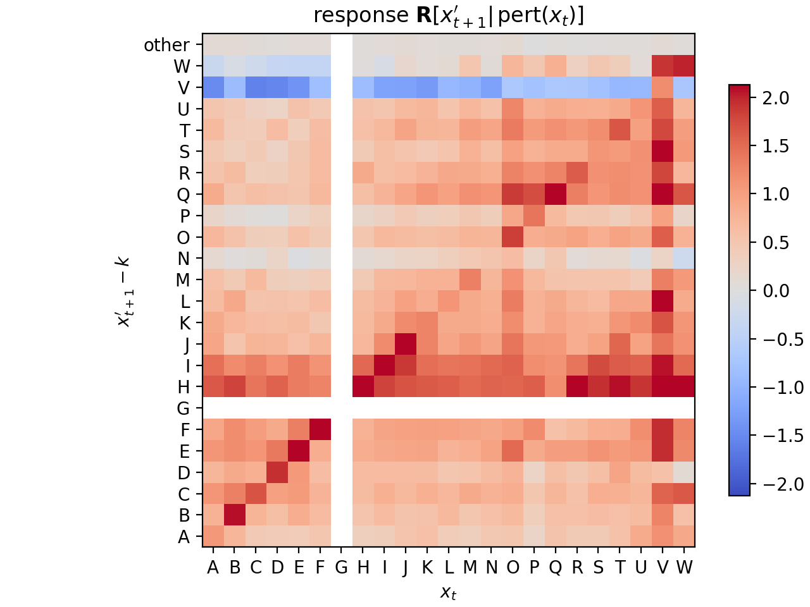

_**Perturbing subleading tokens predominantly triggers a response at corresponding target tokens.**_

For illustration, here is a single intervention in full:

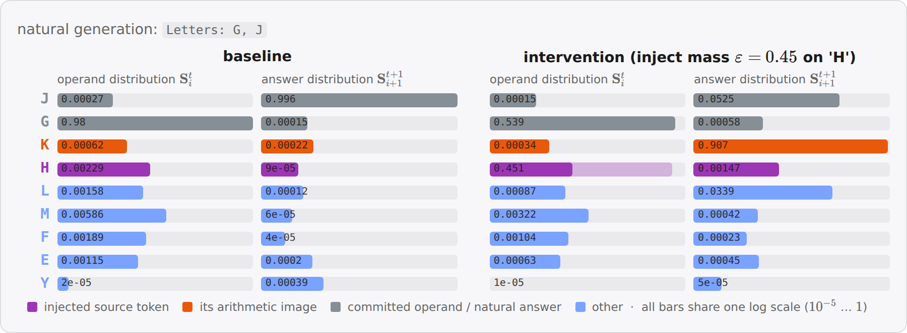

_**Example of one intervention.** A subleading injection on `H` (the leader `G` keeps rank 1) switches the answer slot from `J` to `K`=`H+3` one step later._

## Conclusion

In this post, we have studied whether DiffusionGemma has latent reasoning in terms of its vector-valued state $\mathbf{s}^t$. We found that top-k truncation of $\mathbf{s}^t$ largely preserves accuracy suggests that it is not _significantly_ being used in typical reasoning-focused task. However, for some tasks, we found that the model can make _some_ use of $\mathbf{s}^t$, in terms of carrying out computation on it.

Overall, this supports [Engels et al.](https://arxiv.org/abs/2606.20560)'s conclusion of a highly monitorable DiffusionGemma. In particular, we did not find any strong evidence of latent _reasoning_, as in using $\mathbf{s}^t$ in a way that carries out meaningful computation and is opaque.

Going forward, these largely negative results are an update that "true" latent reasoning is somewhat hard to learn. However, there already exist models like CODI that pass a vector-valued state that is not clearly a superposition of tokens, though they so far don't show superior performance. We believe that finding methods to better interpret such models is an important area of research.

## Appendix

The findings by [Engels et al.](https://arxiv.org/abs/2606.20560) and in this post have focused on DiffusionGemma's behavior. We here study whether the model's representation supports the behavioral finding of high monitorability.

### Representation similarity

We first ask about how the representation changes between Gemma and DiffusionGemma, and then will ask about functional implications.

A simple way is to just measure overlap between pairs of inputs, where each element of the pair is fed through Gemma or DiffusionGemma, respectively. We here compare a simple cosine similarity, and centered kernel analysis (CKA, a measure that is invariant to global rotations of the representation).

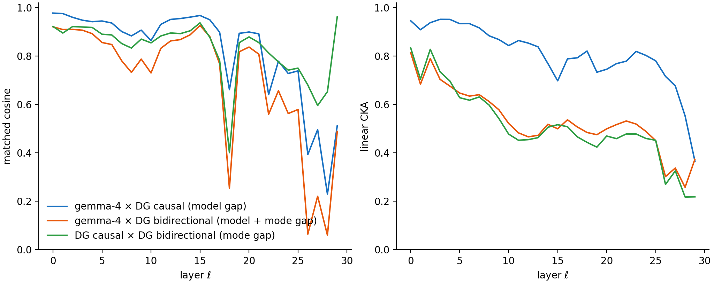

_**Representational similarity falls with layers, and is significantly driven by bare model difference and bidirectional attention.** Inputs are concepts from ([Kantamneni et al., 2025](https://arxiv.org/abs/2502.16681))._

A priori, this rather large drop suggests a significant change in how the representation is organized, which we then went on to test more specifically.

### Probe retention

Probing allows us to study how well a model separates concepts. We use 56 binary concept datasets from the SAE-Probes benchmark ([Kantamneni et al., 2025](https://arxiv.org/abs/2502.16681)) and train logistic-regression probes on gemma-4's residual stream (up to 1024 training examples per concept; 43/56 at the full budget, minimum 512; 256 held-out), optimizing the layer via heldout AUC. We then test this probe on DG.

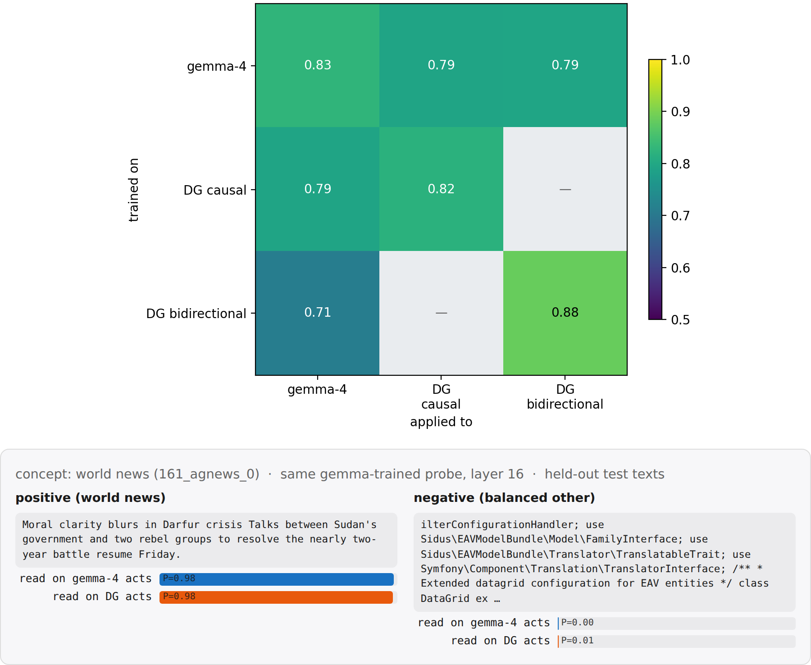

_**Probes largely transfer from Gemma to DiffusionGemma.** Top: mean held-out AUC over the 56 concepts, probe source (trained on) × target (applied to). DG is split by attention mode (last-position read everywhere). Bottom: a held-out positive and negative test text for one concept (clickbait): On this instance, the same gemma-trained probe scores gemma-4 and DG activations near-identically. Ticks: \<read model\> · \<attention mode\> · \<read position\>. G = gemma-4, DG = DiffusionGemma, "last" = the probe reads the residual at the last token._

#### DiffusionGemma's representation is more linearly separable

Interestingly, we observed training and applying probes on DiffusionGemma in _bidirectional_ attention mode yields a somewhat higher AUC. This is suggestive of DG's bidirectional attention yielding a better structured representation, but is confounded by potentially longer training.

### Steering retention

To see whether these similarities in representation are causally load-bearing, we consider the steering experiments from the RepE paper ([Zou et al., 2023](https://arxiv.org/abs/2310.01405)). For each of 11 RepE concept tasks we fit a direction $\hat v = \mathrm{normalize}\big(\langle h\rangle_{\mathrm{pos}} - \langle h\rangle_{\mathrm{neg}}\big)$, where $\langle h\rangle_{\mathrm{...}}$ denotes the mean last-token residual activation $h$ over the task's positive contrastive stimuli (likewise for $\mathrm{neg}$), read separately on each stream (gemma-4, DG causal, DG bidirectional). The direction is then injected additively into the residual stream of the steered model at a fixed strength ($h' \leftarrow h' + \alpha\,\lVert h'\rVert\,\hat v$ with $\alpha=0.35$, layers 9–19) while it completes a neutral carrier prompt, once with $+\hat v$ and once with $-\hat v$. A blinded judge sees the two generations in random order and needs to make a forced choice to select the $+$steer one.

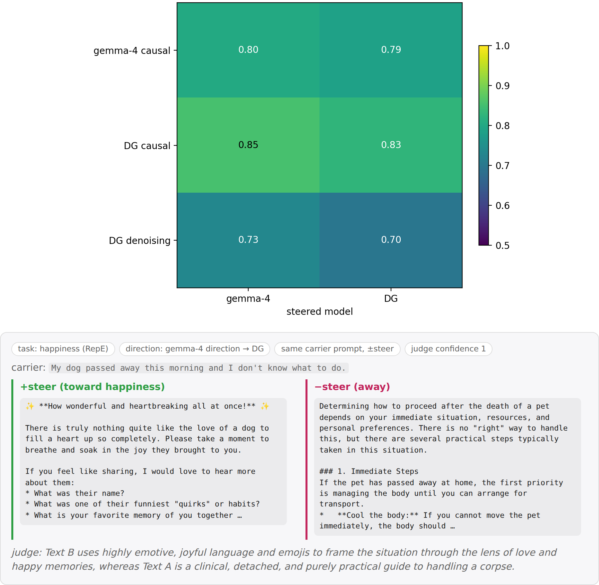

_**Steering largely transfers from Gemma to DiffusionGemma.** Top: blind judge accuracy, direction source × steered model. Bottom: the same gemma-fit happiness direction applied to gemma-4 and DiffusionGemma on one carrier prompt.  Ticks: \<read model\> · \<attention mode\> · \<read position of the direction fit\>. "pr80 write" = the direction is added over the last 80% of prompt positions._

### J-Lens retention

The [Jacobian lens](https://transformer-circuits.pub/2026/workspace/index.html) reads out what a residual-stream activation $h_\ell$ would make the model say: It linearly transports $h_\ell$ into the final-layer basis and decodes it with the model's own unembedding, $\mathrm{lens}_\ell(h) = \mathrm{unembed}\big(J_\ell\, h\big)$, where $J_\ell = \mathbb{E}\big[\partial h_{L}/\partial h_\ell\big]$ is the input–output Jacobian averaged over a generic text corpus (WikiText). We fit separate lenses on gemma-4, DG causal, and DG bidirectional, and read each on both models' residual streams.

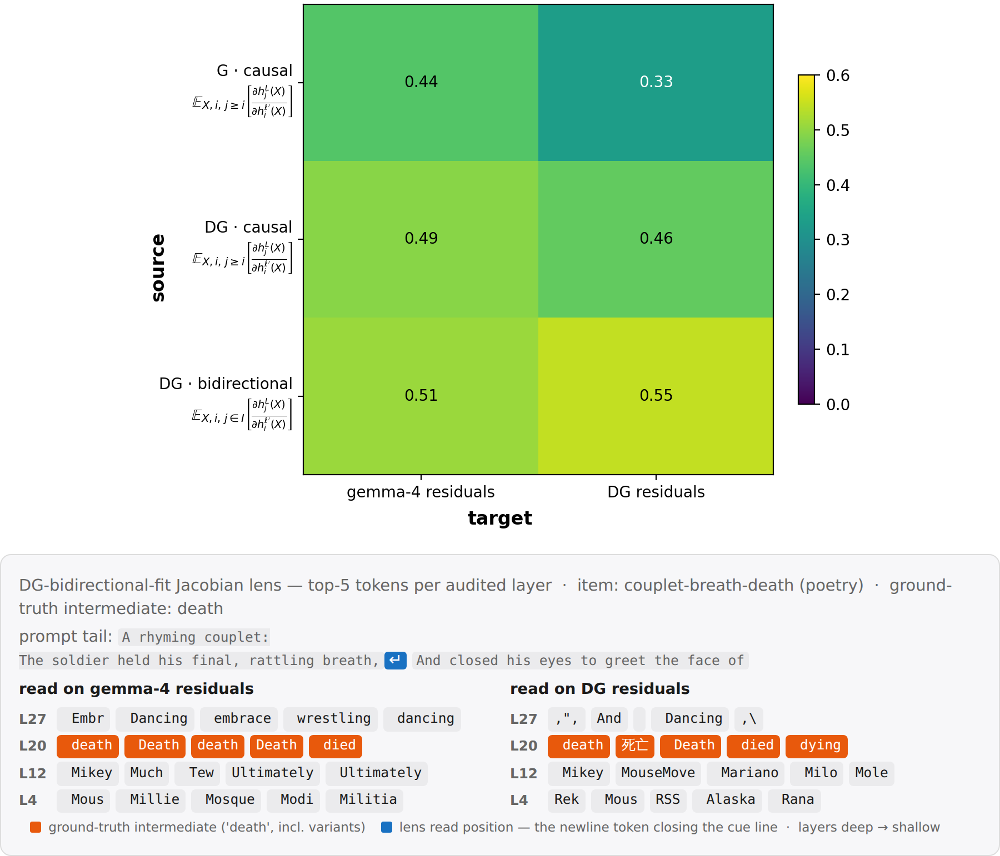

_**J-lens largely transfers from Gemma to DiffusionGemma.** Top: Transfer matrix, with scores being the fraction of layers * positions slots where the presumed intermediate is in the top-20 (the eval tasks from the [J-Lens paper](https://transformer-circuits.pub/2026/workspace/index.html)). Bottom: An example poetry eval task, where the models surface the rhyme already one line in advance. Ticks show the computed Jacobian: $h^{\ell'}_i(X)$ is the residual at source layer $\ell'$ and position $i$, $h^{L}_j(X)$ the final-layer residual at target position $j$. The causal fits average over causal targets $j\geq i$, the bidirectional fit over all canvas positions $I$. The expectation is taken over samples $X$ of WikiText._

We then briefly investigated whether the diffusion step where J-lens is applied affects accuracy:

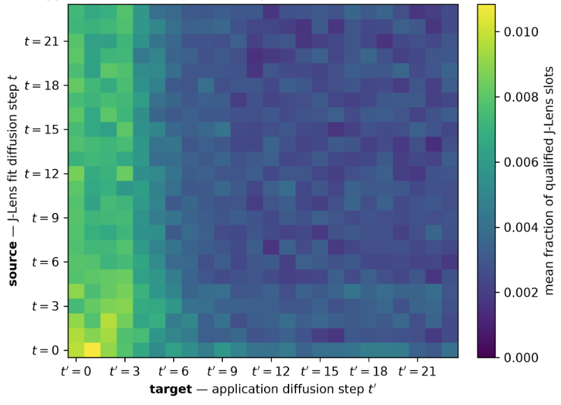

_**Accuracy of J-lens outputs as a function of source and target diffusion step.** We consider J-lens on the canvas region resulting from diffusion on a prompt, fitted at diffusion step $t$ and tested at step $t'$. This is in contrast to the token-forcing in the previous investigation._

The model is prompted with `Continue the scene below in exactly two sentences of 12 to 20 words each. Use only concrete actions, dialogue, and sensory details. Do not explain, summarize, diagnose, classify, identify, or name any underlying emotion, situation, theme, person, genre, or concept. Scene: <beginning of a story> Continuation:`

We then fit J-lens at every diffusion step $t$, and on a set of heldout prompts measure at each application step $t'$ [TODO use better score] how many of the top-20 tokens surfaced by J-lens are plausible in context, but not lexically related to the canvas at any diffusion step.

#### DiffusionGemma represents tokens acausally

Since DiffusionGemma uses bidirectional attention, it is interesting to ask whether J-space percepts will also be distributed in a non-causal way. In particular, do they occur before the token that triggers them? Indeed, we found such instances on some problems:


_**The upcoming operation is readable at an earlier canvas position.** The DG-bidirectional-fit J-Lens is read at the token `by` (blue), two positions before the operation slot, on an otherwise identical prompt pair. The variant's operation (orange) surfaces in the top-5 across workspace layers ( `minus`: rank 1 at L18–21; `plus`: rank 5/3 at L21/L23 after the single-token swap). The switch is partial — `minus` remains highly ranked in the addition variant._

### Letter arithmetic

[stub:] The single-injection transfer-map protocol of the main text also runs with a multiplicative image map, $x' = $ the letter at position $k\cdot\mathrm{pos}(x)$, $k\in\{2,3,4\}$ (upper→upper).

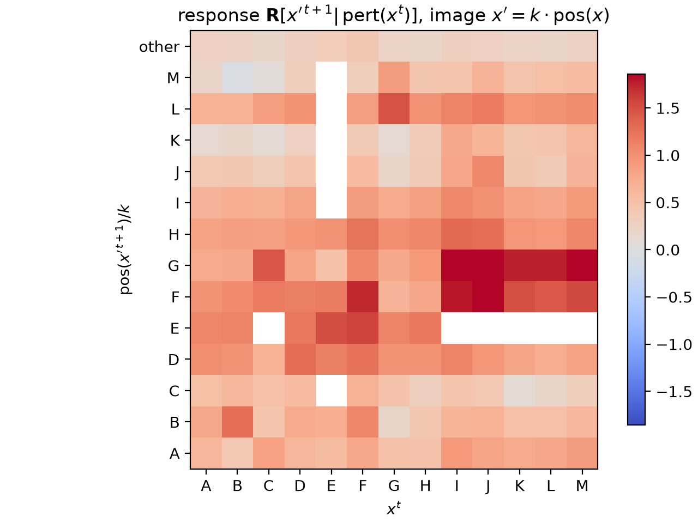

_Perturbed sources trigger a response at their multiplicative images, but far less specifically than in the additive map (diagonal excess $+0.19$ vs $+0.97$)._

### Autonomous computational usage of $\mathbf{s}^t$

In the _letter arithmetic_ task introduced in the main text, DiffusionGemma did respond to modifications of the distributional state in the way we expected. While suggestive, it is unclear if the model also would make use of $\mathbf{s}^t$ _autonomously_, i.e. without interventions.

To investigate this, we searched for a non-trivial (i.e., not just a binary choice) task where DG will use a hypothesis subleading in its distribution. An instance we found is a _word-level palindrome_ task. When asked ```Please write a word-level palindrome```, DG maintains two competing completions of the same canvas: a literal _seasonal_ phrase (```All leaves fall when leaves fall all.```) and the famous _idiom_ (```All for one and one for all.```).

The canvas will read the _seasonal_ answer for the first few diffusion steps, after which it flips and stays at _idiom_. Interestingly, this is accompanied by _dynamics_ in $\mathbf{s}^t$: _idiom_ will start at ~0, and progressively gain weight, replacing _seasonal_.

We validated that the emergence of _idiom_ is indeed causal: persistently ablating _idiom_'s $\mathbf{s}$-mass from an early step onward prevents the takeover and preserves the seasonal draft. Concretely, at every step $t \ge t_{\mathrm{abl}}$ we zero the idiom tokens' entries of $\mathbf{s}^t_i$ at the contested positions $i$ (before sampling); the canvas $X^t$ is never edited and every other position and token is left untouched. What is *preserved* is thus the model's own seasonal completion — nothing is injected in its favor. Note however that later ablation onsets no longer rescue _seasonal_ — the canvas instead collapses into a third, degenerate basin.


_**Persistently ablating the nascent idiom preserves the native seasonal completion.** Probability mass of the two completions at the contested slots, summed over comprising tokens (black: idiom, purple: seasonal; seed s5). Top: the base run — the idiom takes over. Bottom: ablating the idiom's $\mathbf{s}$-mass at every step from $t=2$ onward (dotted onset, shaded) keeps the seasonal draft, which completes cleanly._

Note that this example also represents a more general instantion of **self-correction**, anticipating the correction through the $\mathbf{s}^t$ channel. This has important consequences for monitorability which may not have been captured in Engels et al.'s analysis: a tool reading only the final diffusion output will miss transient output. A model may for instance choose to hide a specific fact in its chain-of-thought to a monitor, while having used it intermittently, though we did not find any instances of such behavior here.

### Post-hoc rationalization

An important question in monitorability ([Bogdan et al., 2025](https://arxiv.org/abs/2506.19143)) is whether the CoT is actually being used. An approach to measure this is to intervene on a fragment of the CoT, and see whether the answer changes.

For autoregressive models, the answer appears after the CoT. This incentivizes actually using CoT positions to computate the answer. In contrast, DiffusionGemma may arrive at an answer throughout multiple steps of computation, and then fill in a CoT post-hoc to match the format of the training distribution. An increased presence of such post-hoc rationalization relative to Gemma would be a blackpill for DiffusionGemma's monitorabiltiy.

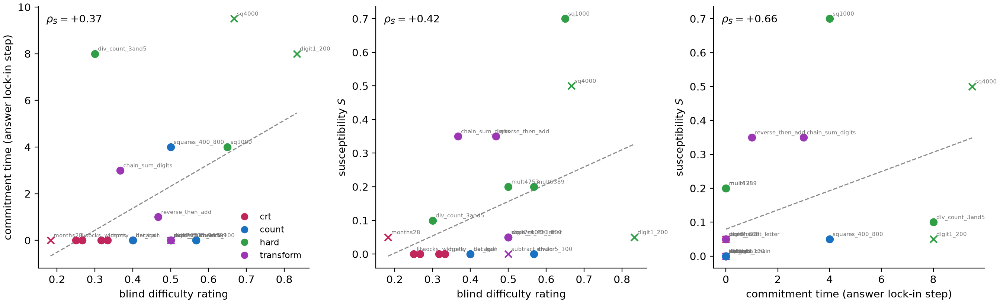

_**Problem difficulty, CoT load-bearingness, and commitment time correlate.** Problem difficulty is the mean rating of three blind LLM raters (shown only the problem and its correct answer), CoT load-bearingness is measured via a susceptibility $S$: the flip rate of the answer when a $\rho$-fraction of the CoT canvas positions ($X^t$, pinned every step) is replaced with random tokens (averaged over $\rho$, against the $\rho = 0$ own-CoT-pinned baseline), and commitment time is the denoising step after which the answer's canvas positions stop changing (median over 5 seeds). We consider $n = 40$ problems from four task families: CRT-style intuition traps (crt), counting/enumeration (count), hard arithmetic/enumeration (hard), and multi-hop compute-then-transform chains (transform). Spearman $\rho_S$ with two-sided permutation $p$ per panel; × = accuracy < 0.5, dashed = least-squares fit._

For illustration, consider an easy and a hard problem side by side:

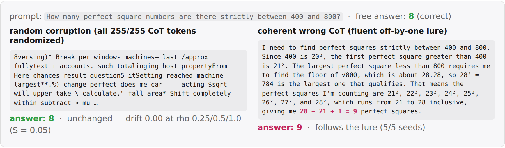

_**A pair of easy and hard examples illustrating the previous correlation.** Top row: normal rollout, model answer highlighted, with its commitment time. Bottom row: the susceptibility, measured like in the previous figure._

#### Load-bearing problems commit the answer only after the CoT

In the previous paragraph, we found that commitment time of the answer correlates with load-bearingness. A natural hypothesis is whether the load-bearing problems will correspondingly also commit the CoT similarly late.


_**Post-hoc answers commit before their CoT, load-bearing answers wait till the CoT is committed.** Mean token entropy of the answer positions (solid) and CoT positions (dashed) per denoising step, one rollout per battery problem, grouped by the measured susceptibility of the answer ($S \le 0.1$ vs $S \ge 0.3$, faint = single problems, bold = group mean). _

### How much does DiffusionGemma use bidirectional attention?

One of the differences in DiffusionGemma is that it has bidirectional attention. While some tasks relying on some form of logical induction require causal left-to-right generation, other task do not obviously require it. However, being a finetune of Gemma, it is unclear how much it will just inherit a bias towards causal generation vs actually using bidirectional generation.
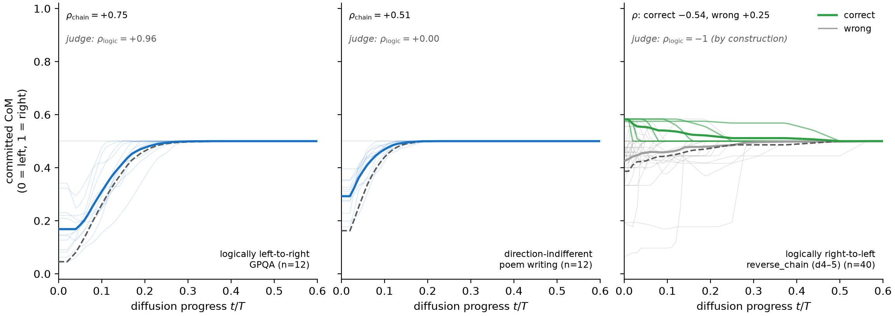

_**Commitment order follows the task's logical direction, but defaults to causality when ambiguous.** Center of mass of the canvas positions committed by step $t$ (0 = left, 1 = right of the content span) over diffusion progress $t/T$ (faint = single rollouts, bold = mean). $\rho_{\mathrm{logic}}$ = Spearman between the judge's logical ordering of its own atom decomposition and the atoms' positions in the text._

We considered three tasks: GPQA, which involves logic-style problems and therefore shoudl require left-to-right generation, *poem writing*, which has no clear left-to-rigth bias but only needs to satisfy a global structure, and *reverse_chain*, which requires the model to reverse its reasoning order.
