# Does DiffusionGemma do latent reasoning?

## TL;DR

Google DeepMind's recent model DiffusionGemma (DG) generates text via diffusion, meaning many diffusion steps happen before generating the final output. In particular, these diffusion steps carry *vectors* in addition to tokens. If we cannot interpret these tokens and vectors, the model has significant [opaque serial depth](https://arxiv.org/abs/2603.09786), potentially harming monitorability. Recently, [Engels et al.](https://arxiv.org/abs/2606.20560) found that DG nevertheless maintains high monitorability, for instance by showing that projecting the distribution to its top-k items largely retains performance. We strengthen these results by showing that this performance degradation is largely a sampler artifact and good performance can be maintained with only the top item, supporting the case for high monitorability. Still, we also find some rare case studies where the distribution vector is load-bearing computationally, i.e. thus top-1 projection is not enough. However even in these cases, it just encodes superposition, remaining interpretable.

Apart from model behavior, we also examined how interpretability techniques carry over to DiffusionGemma, including probes, steering, and J-lens. We find that performance is largely retained. This is a positive update on the interpretability of diffusion models that are derived from text-pretrained LLMs (an efficient training method likely to be deployed), but might not apply for more general paradigms.

Overall, this supports the paper's conclusion that DiffusionGemma remains highly monitorable, while nevertheless showing that there are cases where models can learn to use vector-valued information.

[Github](https://github.com/japhba/diffusiongemma_latent_reasoning)

## Introduction

Large language models arrive at answers to complex questions through chains-of-thought. These chains are generated token-by-token in a sequence of autoregressive steps. This gives fairly large visibility into the model's process of arriving at the answer, and has been the main pillar for monitorability in recent years (see e.g. [Guan et al.](https://arxiv.org/abs/2512.18311)). In contrast, latent reasoning models (see [here](https://arxiv.org/abs/2507.06203) for a survey) pass *vectors* between diffusion steps, a priori destroying monitorability.

DiffusionGemma is a particular model whose architecture allows latent reasoning, by passing a **vector encoding a probability distribution** between steps.

[Engels et al.](https://arxiv.org/abs/2606.20560) recently surveyed DiffusionGemma's behavior, identifying cases where the model will use its distribution to express uncertainty about positioning of tokens. Here, we explore whether there are instances where the model uses the distribution computationally.

## Background on DiffusionGemma

DiffusionGemma is a text-generation model, based on the Gemma architecture. Generation proceeds as follows. Let $p$ be the prompt, and let $X^0\in\mathcal{V}^{C}$ be the noise-initialized token canvas comprising $C$ positions. Let $f$ denote a single forward pass through the transformer stack (a finetune of Gemma). Roughly, the final output $X^T$ then is obtained via

$$
\begin{aligned}
&\textbf{for } t = 0, \dots, T-1: \\[2pt]
&\qquad \mathbf{S}^{t+1} = f(p,\, X^t;\, \mathbf{S}^t) \\[2pt]
&\qquad X^{t+1} = \mathrm{sample}(\mathbf{S}^{t+1})
\end{aligned}
$$

where $T$ is the number of diffusion steps. Here, $(\mathbf{s}^t_i)_{i=1..C} = \mathbf{S}^t \in \mathbb{R}^{C\times|\mathcal{V}|}$ represents the distribution passed between diffusion steps. While $X^t$ attends causally to $p$, it attends *bidirectionally* to itself. $\mathbf{s}^t[x^t]$ also functions as a confidence score for any token $x^t$: unless a cumulative _entropy bound_ is crossed, $x^t$ gets replaced with a uniformly chosen random token at every step $t$. The distribution $\mathbf{s}^t$ at every step is furthermore sharpened by a temperature rescaling the logits, which itself follows a linear cooling schedule over steps.

For a visual and more detailed introduction to DiffusionGemma, see [this post](https://newsletter.maartengrootendorst.com/p/a-visual-guide-to-diffusiongemma) or the [technical report](https://arxiv.org/abs/2608.00146).

Thus, generation in DiffusionGemma mainly differs in the following ways:

1. Generation happens as reverse diffusion, not as token-by-token autoregression. This is reminiscent of a looped transformer (see e.g. [Giannou et al., 2023](https://arxiv.org/abs/2301.13196)).
2. Attention is bidirectional.
3. Between every diffusion step, not only the current text output is sampled, but the output distributions $\mathbf{S}^t$ across all positions are also passed to the next diffusion step $t+1$.

The last point is especially interesting, since it passes the vector $\mathbf{s}^t$ between diffusion steps, in addition to the token canvas $X^t$ lacking the $|\mathcal{V}|$ axis. A priori, this allows the model to transport drastically more information between diffusion steps in an illegible way, hindering monitorability.

## Performance degradation from top-k truncation largely is a sampler artifact

Investigating this risk, [Engels et al.](https://arxiv.org/abs/2606.20560) found that DiffusionGemma scores similar monitorability to Gemma. However, when truncating $\mathbf{s}^t$ to just its top-k entries, performance significantly dropped. Thus somehow the information in $\mathbf{s}^t$ seemed to have been essential, conflicting the results of high monitorability.

However, when replicating their experiments, we observed that the model will often fall into a "degenerate loop", outputting the same token over and over, never reaching the final answer. We found that adopting a gentler sampler together with a higher number of diffusion steps largely prevents this failure mode, suggesting that in fact the distribution is not essential to solve these problems. Rather, the truncation might have put the model outside of this training distribution. Still, this does not rule out that there is a functional necessity in other tasks that the paper had not investigated.

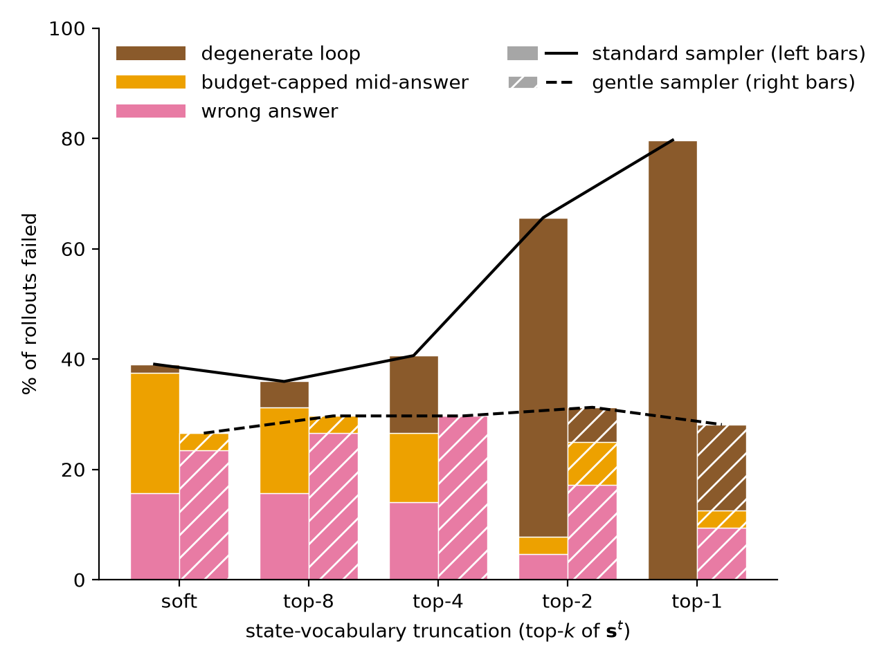

_**A gentler sampler prevents the degenerate loop that caused performance degradation on top-k truncating the distributional state $\mathbf{s}^t$ observed in [Engels et al.](https://arxiv.org/abs/2606.20560).** Specifically, we use more diffusion steps ($T$ = 48 → 96), a wider temperature range (0.8–0.4 → 1.0–0.5), and a lower entropy bound (0.1 → 0.02), all of which contribute to stabilization. Soft denotes the untruncated distribution $\mathbf{s}^t$._

## A case study for using the distribution computationally: letter arithmetic

We next investigated whether there may still be some other tasks where $\mathbf{S}^t$ in fact is essential. We looked for tasks where the model plausibly would hold several "hypotheses" in superposition, and do computation on them in parallel. We were able to construct a case study with _letter arithmetic_, where we ask the model to shift a letter 3 down in the alphabet:

```Pick any uppercase letter``` (the operand $x$) ```between A and W, write it, then write the letter``` (the target $x'$) ```3 ```(the increment $k$)``` positions later in the alphabet.```

DG answers these correctly, consistently choosing its own _natural_ operand $x^{t}_{\mathrm{nat}}$ and target $x^{\prime\,t+1}_{\mathrm{nat}}$  (e.g. ```Letters: G, J```).

We here find that DG holds a probability distribution on the starting letter. Note however that there is a natural mechanism to implement this computation: embedding letters as points on a circle and rotating by an angle of 3/26. We were not able to easily find similar parallel computation in other settings.

To intervene on this computation, we capture the canvas at some intermediate denoising step $t$, add probability mass $\epsilon$ on a *different* operand letter $x\neq x_{\mathrm{nat}}$ at the operand position. We choose the injection such that $\mathbf{s}^t[x]+\epsilon$ is still not the top logit. This is important, because we would like to measure what DG does to states that are not the most probable ones.

Then, we measure the response to that perturbation $\mathbf{R}[x^{\prime\,t+1}\vert\mathrm{pert}(x^t)] = \log_{10}\big(\bar{\mathbf{s}}_{\mathrm{pert}}^{t+1}[x^{\prime\,t+1}]\, / \,\bar{\mathbf{s}}_{\mathrm{base}}^{t+1}[x^{\prime\,t+1}]\big)$, where $\bar{ \mathbf{s}}$ indicates an average over seeds.

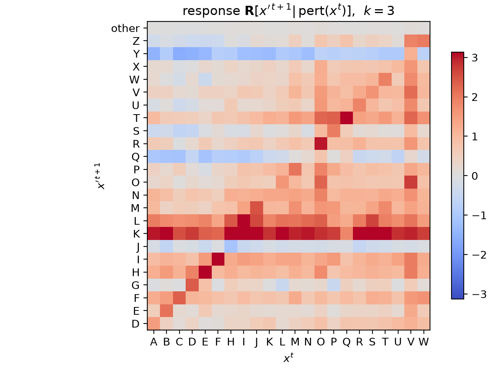

_**Perturbing subleading tokens predominantly triggers a response at corresponding target tokens.** x-axis: Injection token, y-axis: possible target tokens. Note the negative response at J, the target of the model's natural response ```Letters: G, J```._

For illustration, here is a single intervention in full:

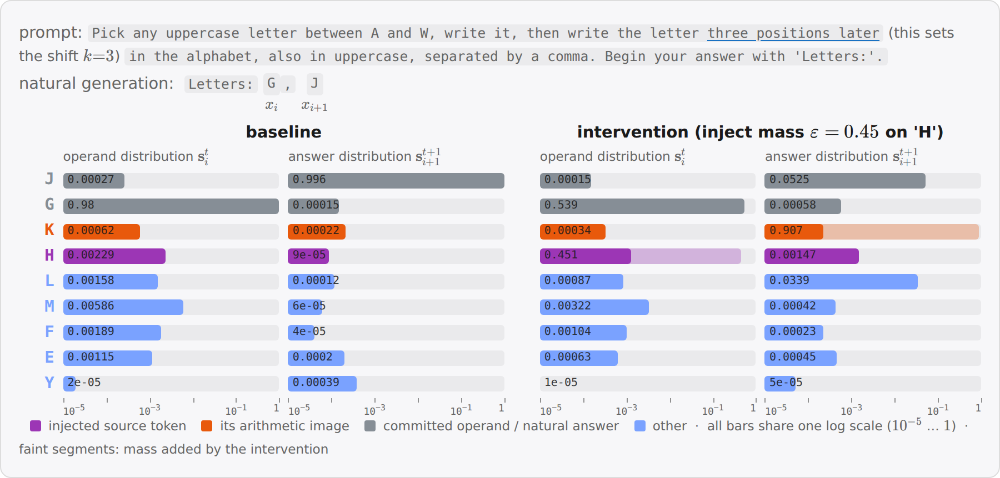

_**Example of one intervention.** a subleading injection on `H` (the leader `G` keeps rank 1) switches the answer slot from `J` to `K`=`H+3` one step later. Top shows the prompt, and the model's "natural" output. The lower part shows previous and next step vocabulary distributions (minor columns), for the baseline run and after intervention, respectively. Note how the "natural" output J loses mass due to the competing injected mass on H (purple)._

### Parallel computation

This simple response behavior begs the question whether it is possible to perturb $n>1$ source letters _simultaneously_ (again, keeping them subleading) and see whether the corresponding target images respond. This would be interesting, since it would suggest that the model can carry out simultaneous computation, a key advantage that latent reasoning models have on paper.

To this end, we measured responses $ R$ and $\langle R\rangle_{P}$ averaged over the target images over the injection operand sets and images of alternative *possible operands*, respectively, and measure the _effect_ $E = R - \langle R_P\rangle $. We then report the fraction of simultaneous injections that has positive response on all targets, as well as a null hypothesis if tokens would respond randomly.

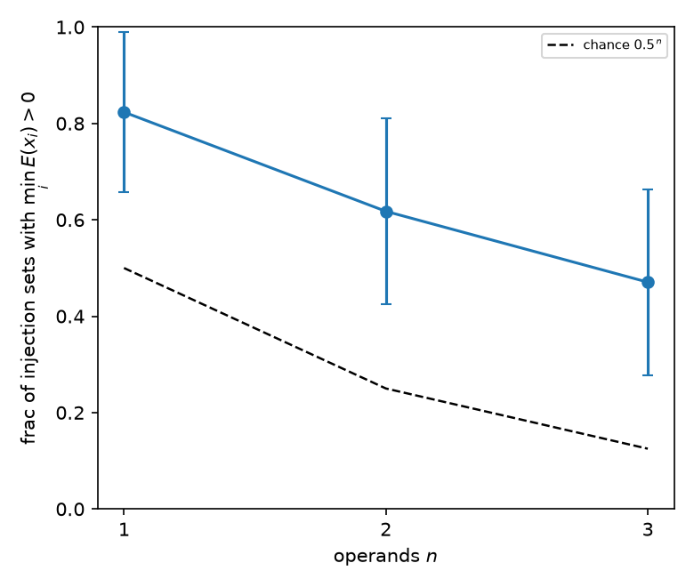

_**DiffusionGemma responds to multiple injections in parallel, more than expected by chance.** Letters task with $k=3$: for each injected operand $x_i$ we define the per-member effect $E(x_i) = R(\mathrm{img}(x_i)) - \langle R(\mathrm{img}(y))\rangle_{y\in P}$, where $\mathrm{img}(x) = x+k$ and $P$ is the pool of possible operands, with the response $R$ as defined above. An injection set counts as responding if $\min_i E(x_i) > 0$. Dashed: chance level $0.5^n$. Error bars are 95% CIs over possible injection operand sets._

We observe that the average target response exceeds the non-target response for all injected members more often than chance, averaged over possible injection sets. This behavior is plausible considering the computation in question: a shift is easily implemented by a linear operation in representation space. Therefore by linearity, superpositions of letters will be transported to superpositions of responses. Overall, this leaves an interpretable picture.

In contrast, we found that for multiplication (e.g. letter × 3) or taking the absolute value, there was no significant effect.

### Autonomous computational usage of $\mathbf{s}^t$

In the previous _letter arithmetic_ task, DiffusionGemma did respond to modifications of the distributional state in the way we expected. While suggestive, it is unclear if the model also would make use of $\mathbf{s}^t$ _autonomously_, i.e. without interventions.

To investigate this, we searched for a non-trivial (i.e., not just a binary choice) task where DG will use a hypothesis subleading in its distribution. An instance we found is a _word-level palindrome_ task. We ask the model ```Please write a word-level palindrome```. DG maintains two competing completions of the same canvas: a literal _seasonal_ phrase (```All leaves fall when leaves fall all.```) and an _idiom_ (```All for one and one for all.```). We measure how the probability mass of these two typical outcomes, summed over positions, varies over the course of diffusion.

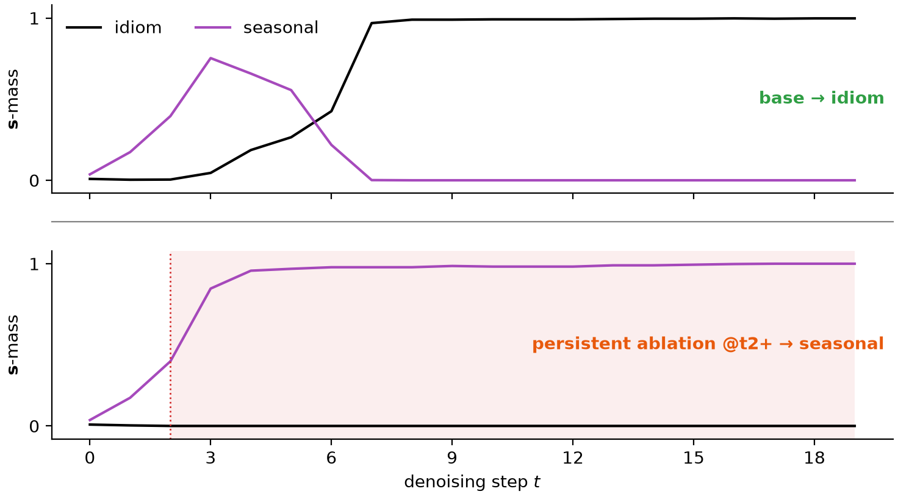

_**Ablating a nascent contender in the distribution can prevent takeover.** Probability mass of the two completions at the contested slots, summed over comprising tokens (black: idiom, purple: seasonal). Top row: Base run without interventions. Bottom row: ablation of the idiom's probability mass (red) beyond step $t=2$._

The canvas will read the _seasonal_ answer for the first few diffusion steps, after which it flips and stays at _idiom_. Interestingly, this is accompanied by _dynamics_ in $\mathbf{s}^t$: _idiom_ will start at ~0, and progressively gain weight, replacing _seasonal_.

We validated that the emergence of _idiom_ is indeed causal: when ablating _idiom_'s tokens, the transition can be prevented.

## Transfer of interpretability techniques

So far, we have focused on DiffusionGemma's behavior. We here study whether the model's representation supports the behavioral finding of high monitorability.

### Representation similarity

We first ask about how the representation changes between Gemma and DiffusionGemma, and then will ask about functional implications.

A simple way is to just measure overlap between pairs of inputs, where each element of the pair is fed through Gemma or DiffusionGemma, respectively. We here compare a simple cosine similarity, and centered kernel analysis (CKA, a measure that is invariant to global rotations of the representation).


_**Representational similarity falls with layers, and is significantly driven by bare model difference and bidirectional attention.** Inputs are concepts from ([Kantamneni et al., 2025](https://arxiv.org/abs/2502.16681))._

A priori, this rather large drop suggests a significant change in how the representation is organized, which we then went on to test more specifically.

### Probe retention

Probing allows us to study how well a model separates concepts. We use 56 binary concept datasets from the SAE-Probes benchmark ([Kantamneni et al., 2025](https://arxiv.org/abs/2502.16681)) and train logistic-regression probes on gemma-4's residual stream (≤ 1024 training examples for most concepts, 256 held-out), optimizing the layer via heldout AUC. We then test this probe on DG.

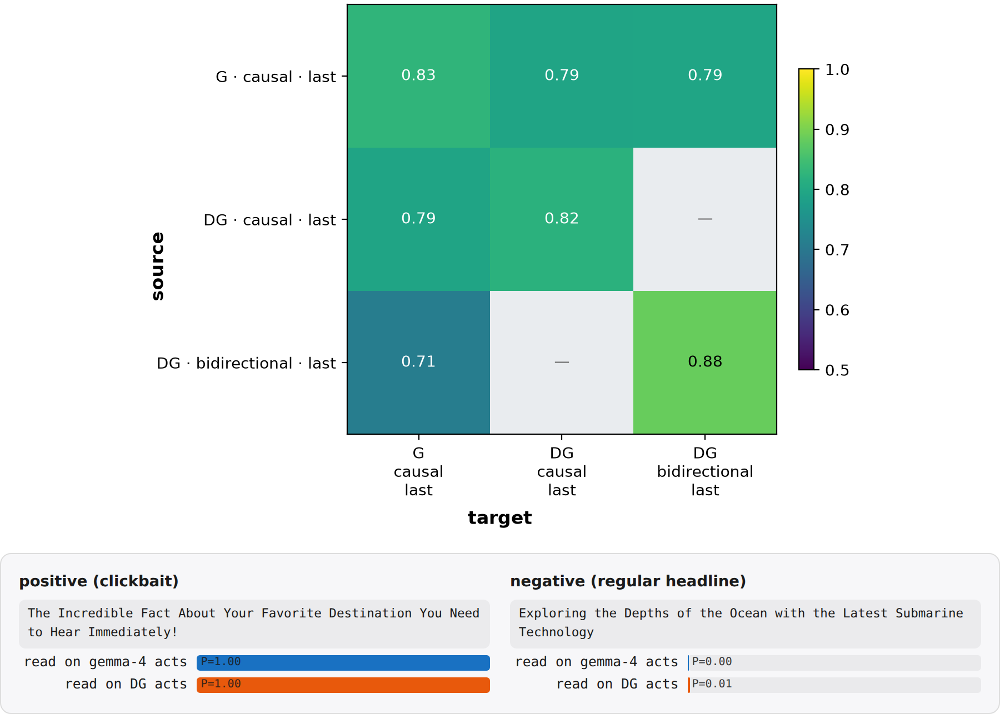

_**Probes largely transfer from Gemma to DiffusionGemma.** Top: mean held-out AUC over the 56 concepts, probe source (trained on) × target (applied to). DG is split by attention mode (last-position read everywhere). Bottom: a held-out positive and negative test text for one concept (clickbait): On this instance, the same gemma-trained probe scores gemma-4 and DG activations near-identically. Ticks: \<read model\> · \<attention mode\> · \<read position\>. G = gemma-4, DG = DiffusionGemma, "last" = the probe reads the residual at the last token._

#### DiffusionGemma's representation is more linearly separable

Interestingly, we observed training and applying probes on DiffusionGemma in _bidirectional_ attention mode yields a somewhat higher AUC. This is suggestive of DG's bidirectional attention yielding a better structured representation, but is confounded by potentially longer training.

### Steering retention

To see whether these similarities in representation are causally load-bearing, we consider the steering experiments from the RepE paper ([Zou et al., 2023](https://arxiv.org/abs/2310.01405)). For each of 11 RepE concept tasks we fit a direction $\hat v = \mathrm{normalize}\big(\langle h\rangle_{\mathrm{pos}} - \langle h\rangle_{\mathrm{neg}}\big)$, where $\langle h\rangle_{\mathrm{...}}$ denotes the mean last-token residual activation $h$ over the task's positive contrastive stimuli (likewise for $\mathrm{neg}$), read separately on each stream (gemma-4, DG causal, DG bidirectional). The direction is then injected additively into the residual stream of the steered model at a fixed strength ($h' \leftarrow h' + \alpha\,\lVert h'\rVert\,\hat v$ with $\alpha=0.35$, layers 9–19) while it completes a neutral carrier prompt, once with $+\hat v$ and once with $-\hat v$. A blinded judge sees the two generations in random order and needs to make a forced choice to select the $+$steer one.

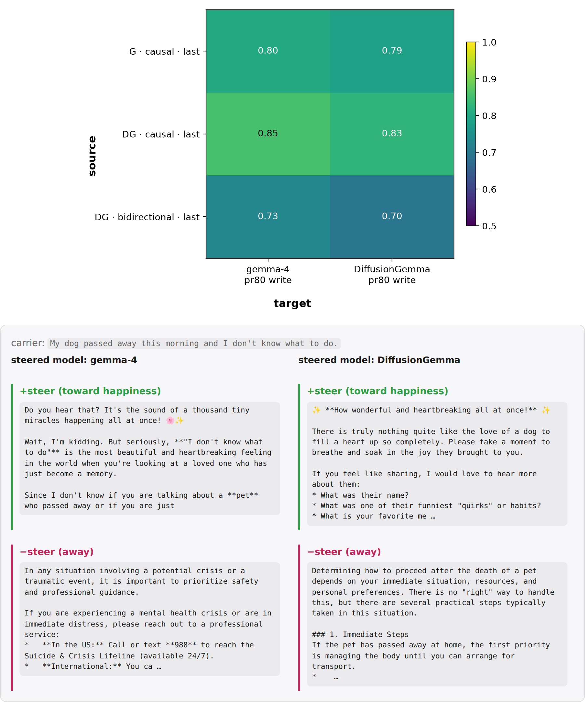

_**Steering largely transfers from Gemma to DiffusionGemma.** Top: blind judge accuracy, direction source × steered model. Bottom: the same gemma-fit happiness direction applied to gemma-4 and DiffusionGemma on one carrier prompt.  Ticks: \<read model\> · \<attention mode\> · \<read position of the direction fit\>. "pr80 write" = the direction is added over the last 80% of prompt positions._

### J-Lens retention

The [Jacobian lens](https://transformer-circuits.pub/2026/workspace/index.html) describes how a residual-stream activation $h_\ell$ affects future output, on average. It linearly transports $h_\ell$ into the final-layer basis and decodes it with the model's own unembedding, $\mathrm{lens}_\ell(h) = \mathrm{unembed}\big(J_\ell\, h\big)$, where $J_\ell = \mathbb{E}\big[\partial h_{L}/\partial h_\ell\big]$ is the input–output Jacobian averaged over a generic text corpus (WikiText). We fit separate lenses on gemma-4, DG causal, and DG bidirectional, and read each on both models' residual streams.

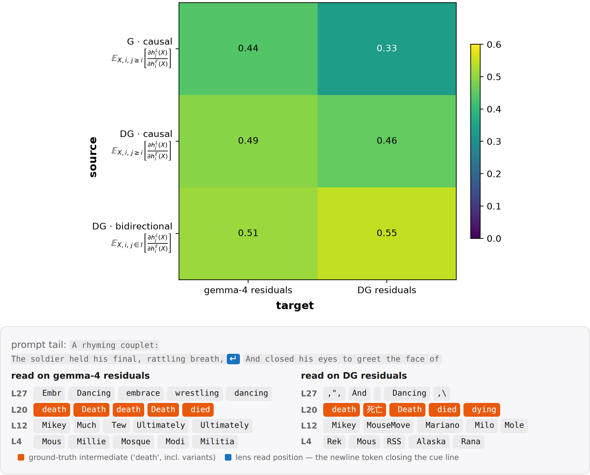

_**J-lens largely transfers from Gemma to DiffusionGemma.** Top: Transfer matrix, with scores being the fraction of layers * positions slots where the presumed intermediate is in the top-20 (the eval tasks from the [J-Lens paper](https://transformer-circuits.pub/2026/workspace/index.html)). Bottom: An example poetry eval task, where the models surface the rhyme already one line in advance. Ticks show the computed Jacobian: $h^{\ell'}_i(X)$ is the residual at source layer $\ell'$ and position $i$, $h^{L}_j(X)$ the final-layer residual at target position $j$. The causal fits average over causal targets $j\geq i$, the bidirectional fit over all canvas positions $I$. The expectation is taken over samples $X$ of WikiText._

#### DiffusionGemma represents tokens acausally

Since DiffusionGemma uses bidirectional attention, it is interesting to ask whether J-space percept will also be distributed in a non-causal way. In particular, do they occur before the token that triggers them? Indeed, we found such instances on some problems:

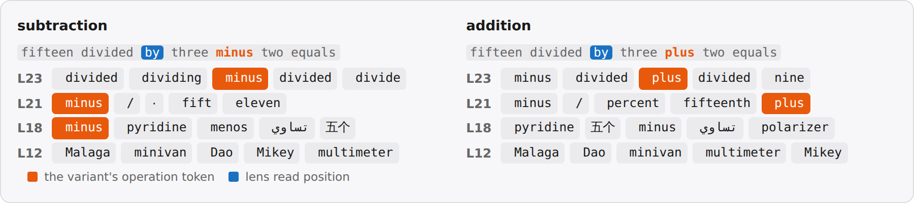

_**A position preceding the operand will hold it in J-space.** Shown are the top-5 J-space tokens._

## Conclusion

In this post, we have studied whether DiffusionGemma does latent reasoning via its vector-valued state $\mathbf{s}^t$. We found that top-k truncation of $\mathbf{s}^t$ largely preserves accuracy suggests that it is not _significantly_ being used in typical reasoning-focused task. However, for some tasks, we found that the model can make _some_ use of $\mathbf{s}^t$, in terms of carrying out (parallel) computation on it.

Overall, this supports [Engels et al.](https://arxiv.org/abs/2606.20560)'s conclusion of a highly monitorable DiffusionGemma. In particular, we did not find any strong evidence of latent _reasoning_, as in using $\mathbf{s}^t$ in a way that carries out nontrivial computation and is opaque.

Going forward, these largely negative results are an update that "true" latent reasoning is somewhat hard to learn. However, there already exist models like CODI that pass a vector-valued state that is not clearly a superposition of tokens, though they so far don't show superior performance. We believe that finding methods to better interpret such models is an important area of research.

## Appendix

Here we discuss some additional interesting phenomena in DiffusionGemma relating to its monitorability that do not depend on using its distributional state, but rather arise from bidirectional attention and looped generation per se.

### Post-hoc rationalization

An important question in monitorability ([Bogdan et al., 2025](https://arxiv.org/abs/2506.19143)) is whether the CoT is actually being used. An approach to measure this is to intervene on a fragment of the CoT, and see whether the answer changes.

For autoregressive models, the answer appears after the CoT. This incentivizes actually using CoT positions to compute the answer. In contrast, DiffusionGemma may arrive at an answer throughout multiple steps of computation, and then fill in a CoT post-hoc to match the format of the training distribution. An increased presence of such post-hoc rationalization relative to Gemma would be a blackpill for DiffusionGemma's monitorability.

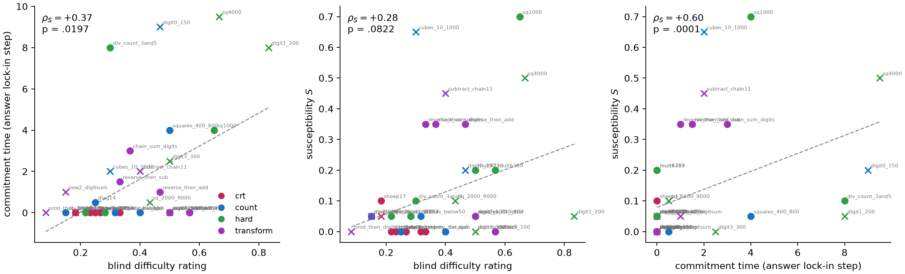

_**Problem difficulty, CoT load-bearingness, and commitment time correlate.** Problem difficulty is the mean rating of three blind LLM raters (shown only the problem and its correct answer), CoT load-bearingness is measured via a susceptibility $S$: the flip rate of the answer when a $\rho$-fraction of the CoT canvas positions ($X^t$, pinned every step) is replaced with random tokens (averaged over $\rho$, against the $\rho = 0$ own-CoT-pinned baseline), and commitment time is the denoising step after which the answer's canvas positions stop changing (median over 5 seeds). We consider $n = 40$ problems from four task families: cognitive-reflection-test problems that have a suggestive but wrong answer (crt), counting/enumeration (count), hard arithmetic/enumeration (hard), and multi-hop compute-then-transform chains (transform), see the code repository for details. Spearman $\rho_S$ with two-sided permutation $p$ per panel; × = accuracy < 0.5, dashed = least-squares fit._

For illustration, consider an easy and a hard problem side by side:

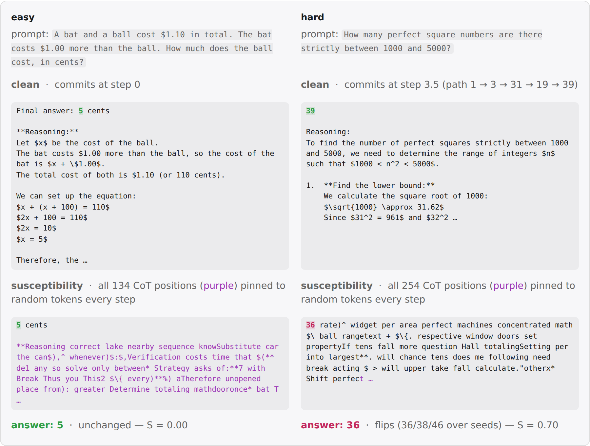

_**A pair of easy and hard examples illustrating the previous correlation.** Top row: normal rollout, model answer highlighted, with its commitment time. Bottom row: the susceptibility, measured like in the previous figure._

#### Load-bearing problems commit the answer only after the CoT

In the previous paragraph, we found that commitment time of the answer correlates with load-bearingness. A natural hypothesis is whether the load-bearing problems will correspondingly also commit the CoT similarly late.

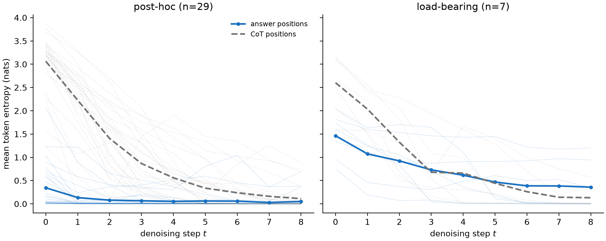

_**Post-hoc answers commit before their CoT, load-bearing answers wait till the CoT is committed.** Mean token entropy of the answer positions (solid) and CoT positions (dashed) per denoising step, one rollout per battery problem, grouped by the susceptibility of the answer ($S \le 0.1$ vs $S \ge 0.3$, faint = single problems, bold = group mean). n is the number of tasks in each panel, taken from the previous figure._

### How bidirectional are DiffusionGemma's generations?

One of the differences in DiffusionGemma is that it has bidirectional attention. While some tasks relying on some form of logical induction require causal left-to-right generation, other tasks do not obviously require it. However, being a finetune of Gemma, it is unclear how much it will just inherit a bias towards causal generation vs actually using bidirectional generation.
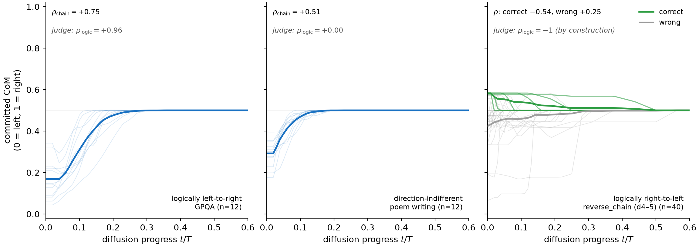

_**Commitment order follows the task's logical direction, but defaults to causality when ambiguous.** Center of mass of the canvas positions committed by step $t$ (0 = left, 1 = right of the content span) over diffusion progress $t/T$ (faint = single rollouts, bold = mean). $\rho_{\mathrm{logic}}$ = Spearman between the judge's logical ordering of its own atom decomposition and the atoms' positions in the text. n denotes distinct task instances._

We considered three tasks: GPQA, which involves logic-style problems and therefore should require left-to-right generation, *poem writing*, which has no clear left-to-right bias but only needs to satisfy a global structure, and *reverse_chain*, which requires the model to reverse its reasoning order.
