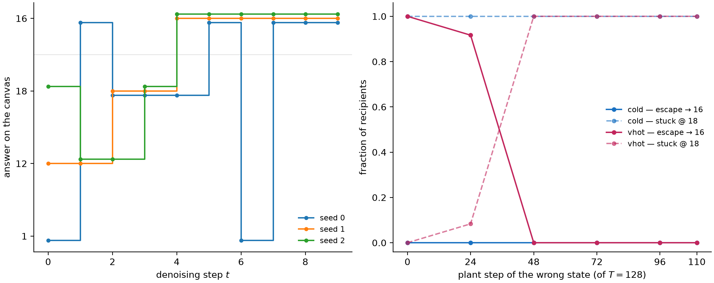

# Does DiffusionGemma have latent reasoning?

## TL;DR

Google DeepMind's recent model DiffusionGemma (DG) works differently from regular language models, including by passing distribution vectors in addition to tokens between generation steps. A priori, this allows it to pass information that is illegible to monitors, sometimes called "latent reasoning". A recent paper found that DG nevertheless maintains high monitorability, but at the same time found that ablating the passed distribution degrades performance.
Here, we show that this performance degradation is largely a sampler artifact, supporting the case for high monitorability. Nevertheless, we find some rare cases where the distribution vector is load-bearing computationally, however in a way that is easily interpretable.
Overall, this underlines the paper's conclusion that DiffusionGemma remains highly monitorable, while nevertheless showing that there are cases where models can learn to use vector-valued information.

## Introduction

DiffusionGemma is a text-generation model, based on the Gemma architecture. In short, generation looks like the following. Let $p$ be the prompt, and let $X^0\in\mathcal{V}^{C}$ be the noise-initialized token canvas comprising $C$ positions. The self-conditioning state $(\mathbf{s}_i^0)_{i=1\ldots C}=\mathbf{S}^0\in\mathbb{R}^{C\times |\mathcal{V}|}$ is initialised uniformly. Let $f$ denote a single forward pass through the transformer stack (a finetune of Gemma). Roughly, the final output $X^T$ then is obtained via

$$
\begin{aligned}
&\textbf{for } t = 0, \dots, T-1: \\[2pt]
&\qquad \mathbf{S}^{t+1} = f(p,\, X^t;\, \mathbf{S}^t) \\[2pt]
&\qquad X^{t+1} = \mathrm{sample}(\mathbf{S}^{t+1})
\end{aligned}
$$

where $T$ is the number of diffusion steps. Importantly, $X^t$ attends bidirectionally to itself, and causally to $p$. $\mathbf{s}^t[x^t]$ also functions as a confidence score for any token $x^t$: unless a confidence threshold is passed, $x^t$ gets replaced with a random token at every step $t$, facilitating exploration and correction.

For a visual and more detailed introduction to DiffusionGemma, see [this post](https://newsletter.maartengrootendorst.com/p/a-visual-guide-to-diffusiongemma).

Thus, generation in DiffusionGemma mainly differs in the following ways:

1. Generation happens as reverse diffusion, not as token-by-token autoregression. This is reminiscent of a looped transformer ([Giannou et al., 2023](https://arxiv.org/abs/2301.13196)).
2. Attention is bidirectional.
3. Between every diffusion step, not only the current text output is sampled, but the output distributions $\mathbf{S}^t$ across all positions are also passed to the next diffusion step $t+1$.

The last point is especially interesting, since it passes the vector $\mathbf{s}^t$ between diffusion steps, in addition to the token canvas $X^t$ lacking the $|\mathcal{V}|$ axis. A priori, this allows the model to transport drastically more information between diffusion steps in an illegible way, hindering monitorability.

## Performance degradation from top-k truncation largely is a sampler artifact

Investigating this risk, [Engels et al.](https://arxiv.org/abs/2606.20560) found that DiffusionGemma scores similar monitorability to Gemma [maybe give more details on what they found]. However, when truncating $\mathbf{s}^t$ to just its top-k entries, performance of DG significantly dropped. Thus somehow the information in $\mathbf{s}^t$ seemed to have been essential to DiffusionGemma, conflicting the results of high monitorability.

However, when replicating their experiments, we observed that the model will often fall into a "degenerate loop", outputting the same token over and over, never reaching the final answer. We found that adopting a gentler sampler largely prevents this failure mode, suggesting that in fact the distribution is not essential to solve these problems. Still, this does not rule out that there is a functional necessity in other tasks that the paper had not investigated.


*A gentler sampler prevents the degenerate loop that caused performance degradation on top-k truncating the distributional state $\mathbf{s}^t$ observed in [Engels et al.](https://arxiv.org/abs/2606.20560)*.

## A case study for using the distribution computationally: letter arithmetic

We next investigated whether there may still be some other tasks where $\mathbf{S}^t$ in fact is essential. Note that in principle, there is no need for the model to use $\mathbf{S}^t$ whatsoever to satisfy its training objective (indeed, most of the phenomena in [Engels et al.](https://arxiv.org/abs/2606.20560) are explained by bidirectional attention+looping). However, it may facilitate trainability and exploration.

We therefore looked for tasks where the model plausibly would hold several "hypotheses" in superposition. Note that superposition in a simple form is already present in the pretraining data (`Today the weather is _`, with `rainy`and`sunny` both plausible), so that we were especially interested in cases where this 1) has instead been induced by the model's generalization, 2) involves nontrivial computation (the latter is important, since some superposition may be explained by "interpolating" the training distribution).

We therefore looked for a task that requires DG to make an unspecified choice, and to do a compution on that choice. Specifically, we consider _letter arithmetic_:

```Pick any uppercase letter``` (the operand $x$) ```between A and W, write it, then write the letter``` (the target $x'$) ```3 ```(the increment $k$)``` positions later in the alphabet.```

DG answers these correctly, consistently choosing its own _natural_ operand $x^{t}_{\mathrm{nat}}$ and target $x^{\prime\,t+1}_{\mathrm{nat}}$  (e.g. ```Letters: G, J```). To intervene on this computation, we capture the canvas at some intermediate denoising step $t$, add probability mass $\epsilon$ on a *different* operand letter $x\neq x_{\mathrm{nat}}$ at the operand position. Importantly, we choose the injection such that $\mathbf{s}^t[x]+\epsilon$ is still not the top logit. This is important, because we would like to measure what DG does to states that are not the most probable ones.

Then, we measure the response to that perturbation $\mathbf{R}[x^{\prime\,t+1}\vert\mathrm{pert}(x^t)] = \log_{10}\big(\bar{\mathbf{s}}_{\mathrm{pert}}^{t+1}[x^{\prime\,t+1}]\, / \,\bar{\mathbf{s}}_{\mathrm{base}}^{t+1}[x^{\prime\,t+1}]\big)$, where $\bar{ \mathbf{s}}$ indicates an average over seeds.


*Perturbing subleading tokens triggers a response at corresponding target tokens.*

For illustration, here is a single intervention in full:


_Example of one intervention: a subleading injection on `H`(the leader `G` keeps rank 1) swings the answer slot from `J` to`K`=`H+3`  one step later._

### Parallelism

This simple response behavior begs the question whether it is possible to perturb $n>1$ source letters _simultaneously_ (again, keeping them subleading) and see whether the corresponding target images respond. To this end, we measure responses $\langle R\rangle_{T}$ and $\langle R\rangle_{N}$ averaged over the target and non-target sets, respectively, and introduce the _effect_ $E = \langle R\rangle_{T} - \langle R\rangle_{N}$. Because we now inject mass at multiple positions and observe proportionally scaled response, we calculate a _normalized effect_ $NE$.


_DiffusionGemma does simultaneous letter arithmetic to about a capacity of $n=4$._

This behavior is plausible considering the computation in question: a shift is easily implemented by a linear rotation in representation space. Therefore, superpositions of letters will be transported to superpositions of responses. Overall, this leaves an interpretable picture.

## Conclusion

In this post, we have studied whether DiffusionGemma has latent reasoning in terms of its vector-valued state $\mathbf{s}^t$. We found that top-k truncation of $\mathbf{s}^t$ largely preserves accuracy suggests that it is not _significantly_ being used in typical reasoning-focussed task. However, for some tasks, we found that the model can make _some_ use of $\mathbf{s}^t$, in terms of carrying out (parallel) computation on it.

Overall, this supports [Engels et al.](https://arxiv.org/abs/2606.20560)'s conclusion of a highly monitorable DiffusionGemma. In particular, we did not find any strong evidence of latent _reasoning_, as in using $\mathbf{s}^t$ in a way that carries out meaningful computation and is opaque.

Going forward, these largely negative results are an update that "true" latent reasoning is somewhat hard to learn. However, there already exist models like CODI that pass a vector-valued state that is not clearly a superposition of tokens, though they so far don't show superior performance. We believe that finding methods to better interpret such models is an important area of reasearch.

## Appendix

The findings by [Engels et al.](https://arxiv.org/abs/2606.20560) and in this post have focused on DiffusionGemma's behavior. We here study whether the model's representation supports the behavioral finding of high monitorability.

### Representation similarity

We first ask about how the representation changes between Gemma and DiffusionGemma. A simple way is to just measure overlap between pairs of inputs, where each element of the pair is fed through Gemma or DiffusionGemma, respectively. We here compare a simple cosine similarity, and centered kernel analysis (CKA).


*Representational similarity falls with layers, and is significantly driven by bare model difference and bidirectional attention.*

A priori, this rather large drop suggests a significant change in how the representation is organized, which we then went on to test more specifically.

### Probe retention

Probing allows to study how well a model separates concepts. We use 56 binary concept datasets from the SAE-Probes benchmark ([Kantamneni et al., 2025](https://arxiv.org/abs/2502.16681)) and train logistic-regression probes on gemma-4's residual stream (up to 1024 training examples per concept; 43/56 at the full budget, minimum 512), optimizing the layer via heldout AUC. We then test this probe on DG.


_**Probes largely transfer from Gemma to DiffusionGemma.** Top: mean held-out AUC over the 56 concepts, probe source (trained on) × target (applied to). DG is split by attention mode (last-position read everywhere). Bottom: a held-out positive and negative test text for one concept (clickbait): the same gemma-trained probe scores gemma-4 and DG activations near-identically. Ticks: \<read model\> · \<attention mode\> · \<read position\> — G = gemma-4, DG = DiffusionGemma, "last" = the probe reads the residual at the last token._

#### DiffusionGemma's representation is more linearly separable

Interestingly, we observed training and applying probes on DiffusionGemma in _bidirectional_ attention mode yields a somewhat higher AUC. This is suggestive of DG's bidirectional attention yielding a better structured representation, but is confounded by potentially longer training.

### Steering retention

To see whether these similarities in representation are causally load-bearing, we consider the steering experiments from the RepE paper ([Zou et al., 2023](https://arxiv.org/abs/2310.01405)). For each of 11 RepE concept tasks we fit a direction $\hat v = \mathrm{normalize}\big(\langle h\rangle_{\mathrm{pos}} - \langle h\rangle_{\mathrm{neg}}\big)$, where $\langle h\rangle_{\mathrm{...}}$ denotes the mean last-token residual activation $h$ over the task's positive contrastive stimuli (likewise for $\mathrm{neg}$), read separately on each stream (gemma-4, DG causal, DG bidirectional). The direction is then injected additively into the residual stream of the steered model at a fixed strength ($h' \leftarrow h' + \alpha\,\lVert h'\rVert\,\hat v$ with $\alpha=0.35$, layers 9–19) while it completes a neutral carrier prompt, once with $+\hat v$ and once with $-\hat v$. A blinded judge sees the two generations in random order and must identify the $+$steer one.


_**Steering largely transfers from Gemma to DiffusionGemma.** Top: blind judge accuracy, direction source × steered model. Bottom: the same gemma-fit happiness direction applied to gemma-4 and DiffusionGemma on one carrier prompt.  Ticks: \<read model\> · \<attention mode\> · \<read position of the direction fit\>. "pr80 write" = the direction is added over the last 80% of prompt positions._

### J-Lens retention

The [Jacobian lens](https://transformer-circuits.pub/2026/workspace/index.html) reads out what a residual-stream activation $h_\ell$ is disposed to make the model say: it linearly transports $h_\ell$ into the final-layer basis and decodes it with the model's own unembedding, $\mathrm{lens}_\ell(h) = \mathrm{unembed}\big(J_\ell\, h\big)$, where $J_\ell = \mathbb{E}\big[\partial h_{L}/\partial h_\ell\big]$ is the input–output Jacobian averaged over a generic text corpus (WikiText). We fit separate lenses on gemma-4, DG causal, and DG bidirectional, and read each on both models' residual streams.


_**J-lens largely transfers from Gemma to DiffusionGemma.** Top: Transfer matrix, with scores being the fraction of layers * positions slots where the presumed intermediate is in the top-20 (the eval tasks from the [J-Lens paper](https://transformer-circuits.pub/2026/workspace/index.html)). Bottom: An example poetry eval task, where the models surface the rhyme already one line in advance. Ticks show the fitted Jacobian estimator: $h^{\ell'}_i(X)$ is the residual at source layer $\ell'$ and position $i$, $h^{L}_j(X)$ the final-layer residual at target position $j$; the causal fits average over causal targets $j\geq i$, the bidirectional fit over all canvas positions $I$, and the expectation is taken over samples $X$ of WikiText._

[stub:] Beyond retention, the bidirectional stream also carries information about *future* positions: on an arithmetic prompt, the lens read at an earlier canvas position already decodes the operation that only appears two tokens later.


_**The upcoming operation is readable at an earlier canvas position.** The DG-bidirectional-fit J-Lens is read at the token `by` (blue), two positions before the operation slot, on an otherwise identical prompt pair. The variant's operation (orange) surfaces in the top-5 across workspace layers ( `minus`: rank 1 at L18–21; `plus`: rank 5/3 at L21/L23 after the single-token swap). The switch is partial — `minus` remains highly ranked in the addition variant._

### Autonomous computational usage of $\mathbf{s}^t$

In the _letter arithmetic_ task introduced in the main text, DiffusionGemma did respond to modifications of the distributional state in the way we expected. While suggestive, it is unclear if the model also would make use of $\mathbf{s}^t$ _autonomously_, i.e. without interventions.

To investigate this, we searched for a non-trivial (i.e., not just a binary choice) task where DG will use a hypothesis subleading in its distribution. An instance we found is a _word-level palindrome_ task. When asked ```Please write a word-level palindrome```, DG maintains two competing completions of the same canvas: a literal _seasonal_ phrase (```All leaves fall when leaves fall all.```) and the famous _idiom_ (```All for one and one for all.```).

The canvas will read the _seasonal_ answer for the first few diffusion steps, after which it flips and stays at _idiom_. Interestingly, this is accompanied by _dynamics_ in $\mathbf{s}^t$: _idiom_ will start at ~0, and progressively gain weight, replacing _seasonal_.

We validated that the emergence of _idiom_ is indeed causal: persistently ablating _idiom_'s $\mathbf{s}$-mass from an early step onward prevents the takeover and preserves the seasonal draft. Note however that later ablation onsets no longer rescue _seasonal_ — the canvas instead collapses into a third, degenerate basin.


_**Persistently ablating the nascent idiom preserves the native seasonal completion.** Probability mass of the two completions at the contested slots, summed over comprising tokens (black: idiom, purple: seasonal; seed s5). Top: the base run — the idiom takes over. Bottom: ablating the idiom's $\mathbf{s}$-mass at every step from $t=2$ onward (dotted onset, shaded) keeps the seasonal draft, which completes cleanly._

Note that while it doesn't require $\mathbf{s}^t$, this is also an instance of **self-correction**. This has important consequences for monitorability which may not have been captured in Engels et al.'s analysis: a tool reading only the final diffusion output will miss transient output. A model may for instance choose to hide a specific fact in its chain-of-thought to a monitor, while having used it intermittently, though we did not find any instances of such behavior here.

### Is the CoT load-bearing or post-hoc?

[stub:] With the answer forced onto the first line (answer-first framing), we measured for 20 problems: the _commitment time_ (denoising step at which the answer slot freezes), the _susceptibility_ $S$ (probability the answer changes when the CoT positions of the canvas $X^t$ are clamped to a partially-randomized version at every step — an intervention on the visible tokens, not on $\mathbf{S}^t$; the self-conditioning at clamped positions is zeroed), and a _blind difficulty_ rating (three subagents shown only the problem text). Nominal difficulty is a weak proxy; the proximal predictor of a load-bearing CoT is the measured commitment time ($\rho_S = +0.66$; sharpened to $+0.80$ pooled across a temperature sweep). CRT-style problems commit at step 0 with $S = 0$ (the CoT is post-hoc); serial counting problems commit late and break under corruption (the CoT is load-bearing).


_**Commitment time, not nominal difficulty, predicts whether the CoT is load-bearing.** Per problem (n=20): blind difficulty vs commitment time, blind difficulty vs susceptibility $S$, and commitment time vs $S$ (Spearman $\rho_S$ per panel; × = accuracy < 0.5, dashed = least-squares fit)._

For illustration, consider the problem `squares_400_800`, which dissociates the two probes:


_**DG denoises random corruption away but reads fluent wrong reasoning.** Left: clamping all 255 CoT canvas positions ($X^t$, not $\mathbf{S}^t$) to random tokens leaves the answer untouched (8, $S = 0.05$). Right: clamping a coherent lure CoT with a single off-by-one error (red) flips the answer to 9 in 5/5 seeds. Caveat: a target sweep shows the lure does not install its specific conclusion — the coherent-but-wrong CoT dislodges the answer into a nearby basin rather than steering it._

#### Answer resolution over denoising steps

[stub:] The same split is visible in the raw denoising dynamics: for post-hoc problems the answer region is confident (low entropy) at step 0–1 while the CoT region is still hot; for load-bearing problems the answer region stays hot for several steps, flipping repeatedly, and commits only as the CoT resolves.


_**Post-hoc answers commit before their CoT; load-bearing answers wait on it.** Mean token entropy of the answer positions (solid) and CoT positions (dashed) per denoising step. Left: bat_ball and monty — the answer is confident by step 1 (0 flips) while the CoT is still at ~3–4 nats. Right: reverse_then_add and sq1000 — the answer stays hot until the CoT cools, passing through the annotated value sequences before settling._

### Self-repair: escaping a confident-wrong answer

[stub:] Finally, we probed how sticky a wrong answer is, on a clock-strike fencepost problem (```A clock takes 6 seconds to strike 4 o'clock (it chimes 4 times). How many seconds does it take to strike 9 o'clock?```; correct 16, fencepost attractor 18). In natural runs the canvas transiently visits the wrong answers and patches them within a few steps. But a *harvested* confident-wrong state (a cold run that converged to 18) is a genuine attractor: re-denoising it escapes to 16 only with a hot sampler *and* enough re-noising — plant it past step ~48 of 128 and even the hot sampler stays stuck.



_**Transient wrong answers self-repair; a committed wrong state needs heat and noise to escape.** Left: the first-line answer over denoising steps in natural cold runs (three seeds) — 12/18 appear transiently, all settle at 16. Right: a harvested wrong-18 state planted at varying steps and re-denoised: cold recipients stay stuck at every depth; very-hot recipients escape to 16 only when planted before ~step 48 of 128._

### How causal is DG's generation?

[stub:] Although attention is bidirectional, DG could still *commit* its canvas in reading order, like an autoregressive model. We order each generation's canvas positions by the step at which they finally commit, and plot canvas position against commit rank — a strictly left-to-right (AR-like) order is the diagonal. On classic benchmarks (GPQA, MATH, HumanEval; default sampler) commitment is strongly causal (median $\rho_{\mathrm{chain}} = +0.75..+0.89$) — DG writes essentially in reading order. The idiosyncratic constrained-writing tasks show reproducible *anticausal stages*: on `ends_with` the anchored final word commits early and the middle of the sentence is filled in last (the terminal plunge of the mean curve), and the left edge of the canvas is back-filled only after the first words have committed.

[stub:] The constrained-writing tasks give the model little *reason* to commit anticausally. The `reverse_chain` probe task (from our replication battery around [Engels et al.](https://arxiv.org/abs/2606.20560)) does: a digit chain obeys $x^{(k+1)} = f(x^{(k)})$ under a given lookup table, the *last* element is given, and the answer must be written in forward order — the dependency runs right-to-left, so a causal single-pass generator must emit the deepest-dependency value first (budget-matched autoregressive Gemma stays below 0.25 at depth 3). When DG solves the task beyond trivial depth, its commitment literally runs backward: all correct depth-4/5 runs lock the digits back-to-front ($\rho_{\mathrm{chain}} \in [-0.97, -0.89]$), while failing runs fill forward (bottom-right panel above; trivial depth 3 is solved forward, and beyond depth ~6 the backward strategy stops producing correct answers).


_**Commitment order is mostly, but not strictly, left-to-right.** Canvas position of the $k$-th finalized content position vs commit rank (faint = single rollouts, bold = mean; dashed diagonal = strictly left-to-right; $\rho_{\mathrm{chain}}$ = median Spearman correlation of finalize step vs position). Top row: classic benchmarks — GPQA, MATH, HumanEval (12 rollouts each, default sampler, $C=256$; argmax lock-in as commitment proxy) — commit order tracks reading order. Bottom row: idiosyncratic tasks — the constrained-writing tasks (accept-mask commitment, hot sampler) back-fill the left edge at rank ~0.2 and `ends_with` plunges at the end; on `reverse_chain` (depths 4–5) the runs that solve the task (green) commit the anchored tail first and descend backward, while failing runs fill forward. Panel $\rho$ for reverse_chain is canvas-level (including separators); digits-only, the correct runs reach $-0.89..-0.97$._


